# Uploadcare Rails Example app

This example project demonstrates the uploadcare-rails capabilities.
The app is pinned to the `5-0-stable` branches of `uploadcare/uploadcare-rails` and `uploadcare/uploadcare-ruby`, runs on Ruby `4.0.1` and Rails `8.1.2.1`, and uses pnpm-managed Hotwire assets.

* [Installation](#installation)
  * [Requirements](#requirements)
  * [Local setup](#local-setup)
* [Usage](#usage)
  * [Configuration](#configuration)
  * [Project section](#project-section)
  * [Files section](#files-section)
  * [File Groups section](#file-groups-section)
  * [Files uploading](#files-uploading)
    * [Upload a local file](#upload-a-local-file)
    * [Upload a file from URL](#upload-a-file-from-url)
  * [Conversion](#conversion)
    * [Documents conversion](#documents-conversion)
    * [Video conversion](#video-conversion)
  * [Webhooks](#webhooks)
  * [Metadata section](#metadata-section)
  * [Add-Ons section](#add-ons-section)
    * [Virus scan](#virus-scan)
    * [Rekognition Labels](#rekognition-labels)
    * [Rekognition Moderation Labels](#rekognition-moderation-labels)
    * [Remove BG](#remove-bg)
  * [Posts section](#posts-section)
  * [Active Storage section](#active-storage-section)
  * [Comments section](#comments-section-mongoid-orm)
* [Useful links](#useful-links)

## Installation

### Requirements

- `mise`
- Ruby `4.0.1`
- Node.js `22.x`
- pnpm `10.x`
- PostgreSQL
- MongoDB

### Local setup

Clone the repository and install dependencies:

```console
$ git clone git@github.com:uploadcare/uploadcare-rails-example.git
$ cd uploadcare-rails-example
$ mise exec -- bundle install
$ mise exec -- pnpm install
$ mise exec -- pnpm build
$ mise exec -- ruby bin/rails db:prepare
$ mise exec -- ruby bin/rails db:migrate
```

Set your Uploadcare credentials before booting the app:

```console
$ export UPLOADCARE_PUBLIC_KEY=demopublickey
$ export UPLOADCARE_SECRET_KEY=demoprivatekey
```

Start the server and the pnpm watcher together:

```console
$ ./bin/dev
```

`bin/dev` runs Rails plus `pnpm build --watch`, so Hotwire assets stay current while you work.

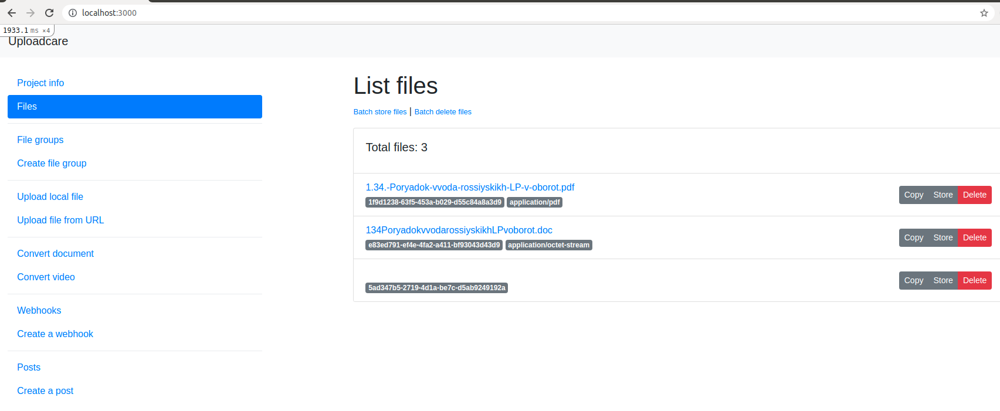


## Usage

### Configuration

To start using the application you need to set your API keys (public key and secret key).
These keys can be set as ENV variables using the `export` directive:

```console
$ export UPLOADCARE_PUBLIC_KEY=demopublickey
$ export UPLOADCARE_SECRET_KEY=demoprivatekey
```
Or you can use `dotenv-rails` for setting ENV variables.

The public key must be specified in `config/initializers/uploadcare.rb` to use Uploadcare file upload.
This step is done automatically in the initializer if you set the ENV variable `UPLOADCARE_PUBLIC_KEY` earlier.

```ruby
...
Uploadcare::Rails.configure do |config|
  # Sets your Uploadcare public key.
  config.public_key = ENV.fetch('UPLOADCARE_PUBLIC_KEY', 'demopublickey')
  ...
end
```

There are also some options set by default:

```ruby
...
# Deletes files from Uploadcare servers after object destroy.
config.delete_files_after_destroy = true

# Sets caching for Uploadcare files
config.cache_files = true

# Available locales currently are:
# ar az ca cs da de el en es et fr he it ja ko lv nb nl pl pt ro ru sk sr sv tr uk vi zhTW zh
config.locale = 'en'
```

Then you can configure all global variables such as files storing/caching, deleting files, etc.
Full list of available options is listed in the file itself. Just uncomment an option and set the value.


### Project section

You can get the project information by your public key.

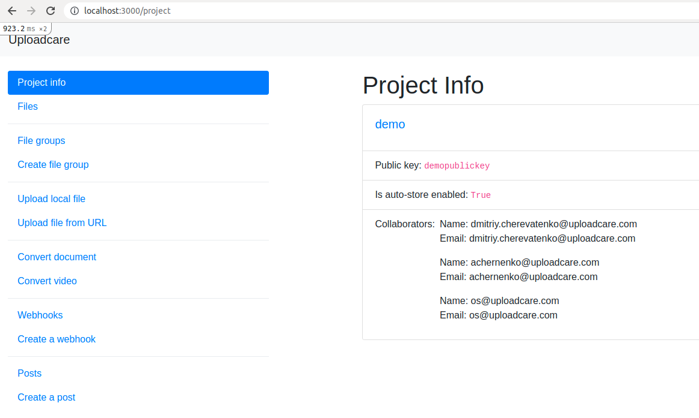

### Files section

This section contains operations with files. Such as uploading, copying, storing, deleting.
The page shows all the files you have on Uploadcare servers. Each file has actions, so it is possible to manage files on this page as well as on the `show` page.

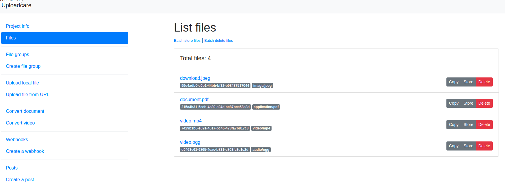

To go to the `show` page, simply click on a filename:

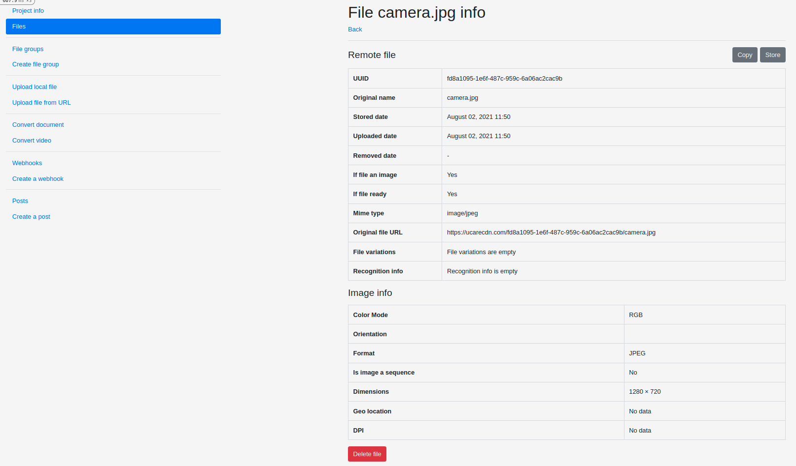

The `index` page also has links to files batch operations pages — batch store and batch delete.
Pages for batch operations look similar and allow to select several files to store them or delete at once.

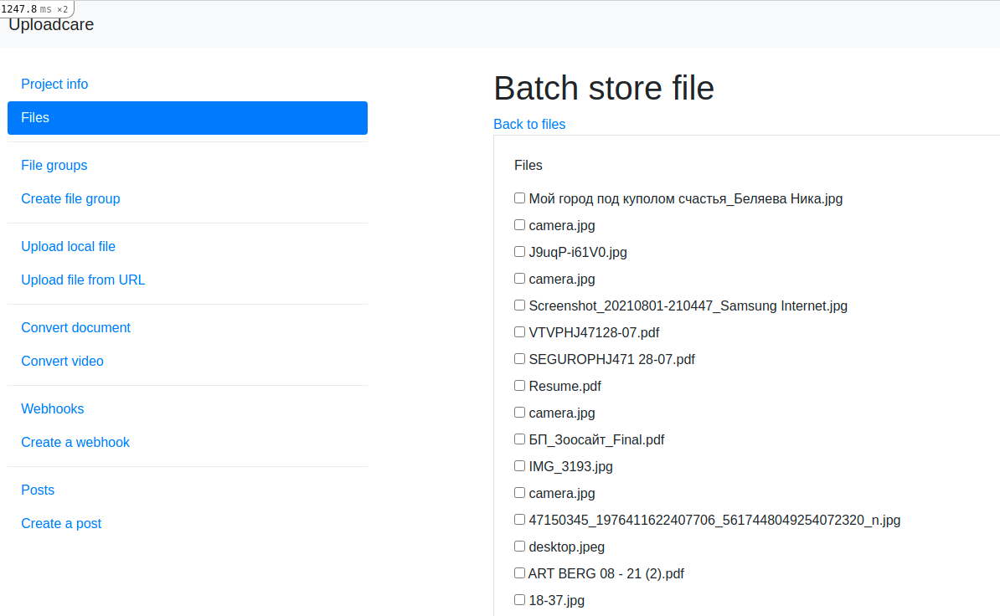

### File Groups section

File Groups section provides user interface to manage file groups on Uploadcare.

The `index` page shows a minimal info about each group including ID and files count.

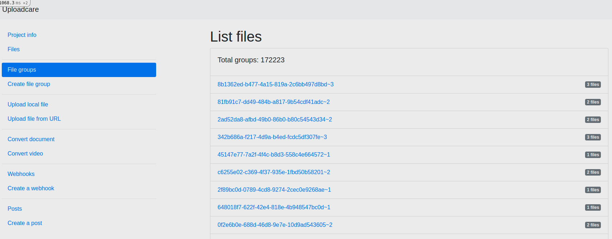

Click on a group ID, you go to the `show` group page:

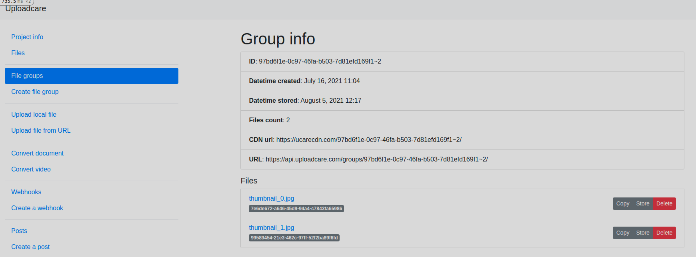

This page also provides actions to manage group files and a group itself (`store` operation only unless a group is already stored).

To create a new group, click on the `Create file group` button in the menu. The form will be opened:

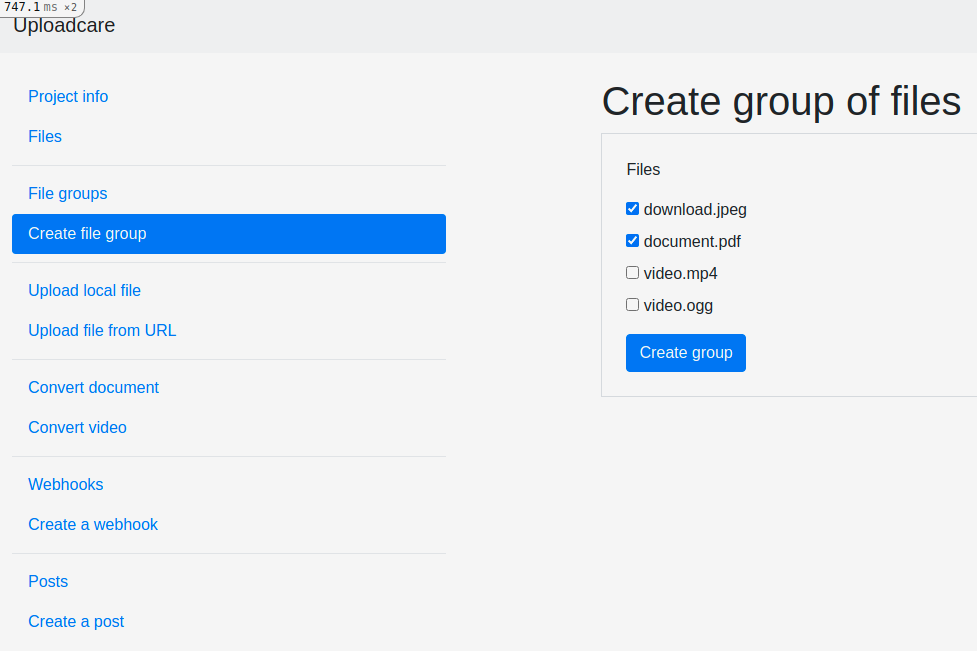


### Files uploading

The example app uploads files in three ways: local file upload via the Upload API, URL upload via the Upload API, and model-backed form uploads via the Uploadcare File Uploader Web Components used in the Posts and Comments sections.

---
**NOTE**

The app now uses the current `5-0-stable` branch APIs. The Post and Comment forms render the v1 Uploadcare File Uploader Web Components directly with `<uc-form-input>`, `<uc-config>`, `<uc-file-uploader-regular>`, and `<uc-upload-ctx-provider>`. Group uploads submit a single Uploadcare group URL that matches `has_uploadcare_files`. Manual API actions in controllers use `Uploadcare::Rails.client`, and the conversion examples use the raw REST parity layer where exact path control is needed.

---

#### Upload a local file

To upload local file from your machine, click on `Upload local file` button in the menu. Then click `Browse` on the form and check a file to upload.
All the fields in the form will be filled automatically depending on file's mime-type and filename. You can input your custom mime-type and filename, though.
There is also `Store` option indicating if Uploadcare will store your file permanently (if enabled) or remove it after 24 hours.

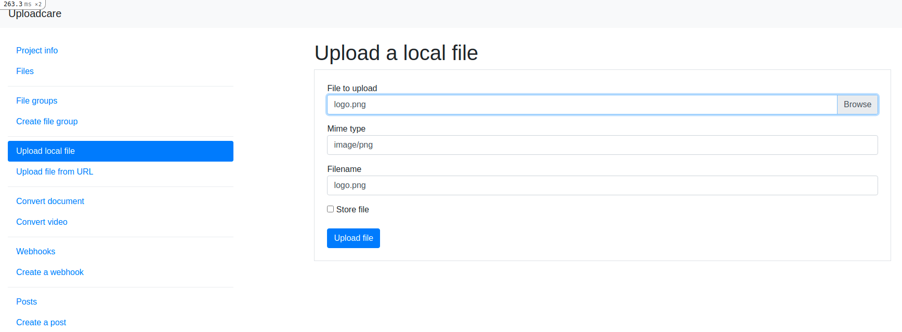

#### Upload a file from URL

To upload a file from URL, click on the appropriate button in the menu. This form has one text input for an URL and one for a filename. `Store` option is present as well.
All you need is input file's URL and filename, check (or not) the `Store` check-box and a file will be uploaded.

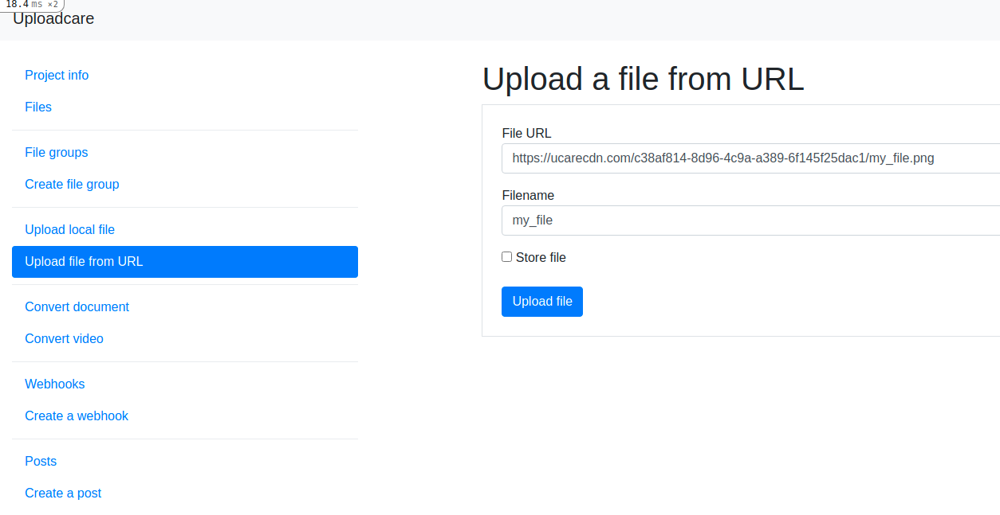


### Conversion

The application manages document and video conversions through the current Uploadcare REST API. The document and video forms build explicit conversion paths and submit them through the raw parity layer exposed under `Uploadcare::Rails.client.api.rest`.

---
**NOTE**

Remember, to convert files, your account must have this feature enabled. It means that your UPLOADCARE_PUBLIC_KEY and UPLOADCARE_SECRET_KEY (not demo keys) must be specified in `config/initializers/uploadcare.rb`. This feature is only available for paid plans.

---

#### Documents conversion

To convert a document, go to the `Convert document` section, choose a file to convert, target format and page (if the chosen target format is `jpg` or `png` and you want to convert a single page of a multi-paged document). There are three check-boxes. `Store` is responsible for storing files as mentioned above. The `Save in group` option allows conversion of a multi-page document into a file group. And, the `Throw error` option detects if the app should raise an error instead of rescuing this within a simple flash message.

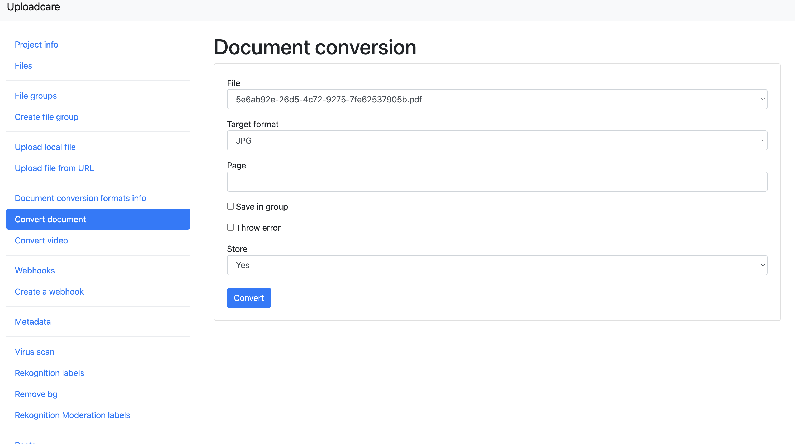

After the form is submitted, if you have not selected the `Save in group` option, you'll see a `Conversion result page`, which shows some info about conversion: `Status`, `Error` and output file's UUID.
Updating the page will refresh the status as said on the page.

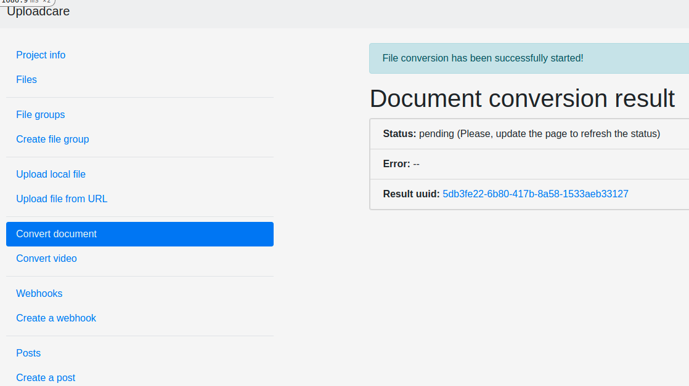

If you have selected the `Save in group` option, you'll be redirected to the `Document conversion formats info` page. Here you can see the group UUID for the converted format in the `Converted Groups` section. It may take some time to convert a document, so you can refresh the page to see the `Converted Groups`.

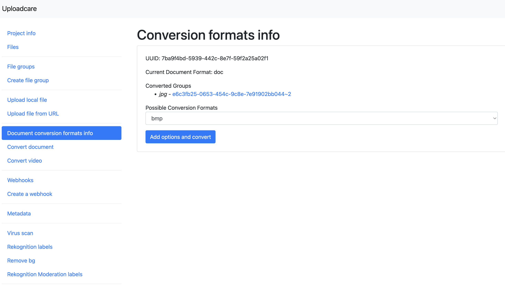

#### Video conversion

Video conversion works the same way but the form has some additional parameters to set. As the document form it has `File`, `Target format` and check-boxes — `Throw error` and `Store`. But you can also specify `quality`, `resize`, `cut` and `thumbs` options.

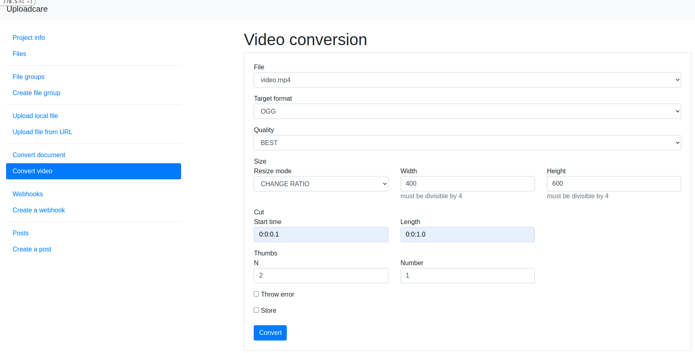

Conversion result page also includes information about how conversion is going.

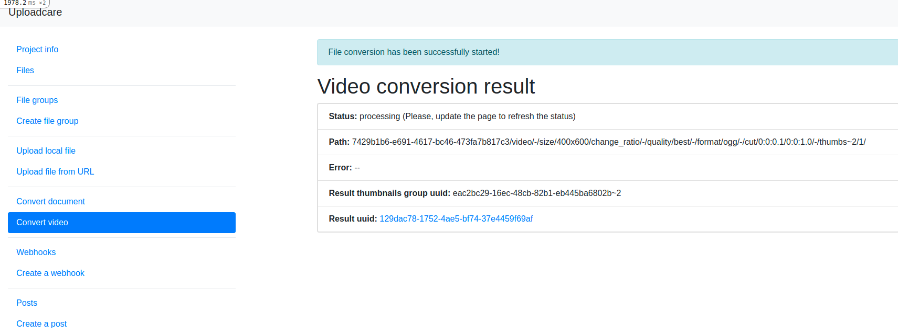


### Webhooks

The `webhooks` section represents CRUD(create, read, update, delete) operations for Uploadcare webhooks.

---
**NOTE**

Remember, to manage webhooks, your account must have this feature enabled. It means that your UPLOADCARE_PUBLIC_KEY and UPLOADCARE_SECRET_KEY (not demo keys) must be specified in `config/initializers/uploadcare.rb`. This feature is only available for paid plans.

---

The menu button `Webhooks` points to the webhooks list page. Each list item has `edit/delete` actions and minimal info about a webhook.

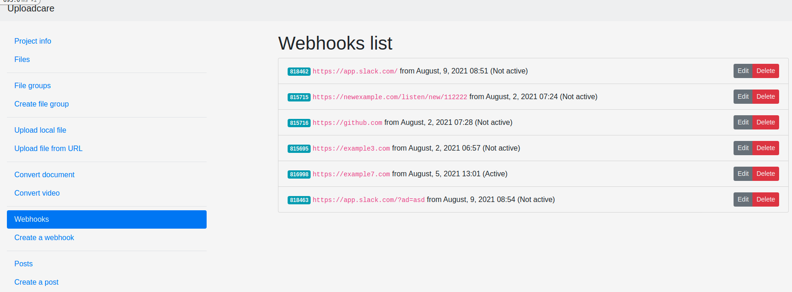

Clicking on an ID of a list item redirects you to the `show` page of a webhook. Here you can find additional info and actions.

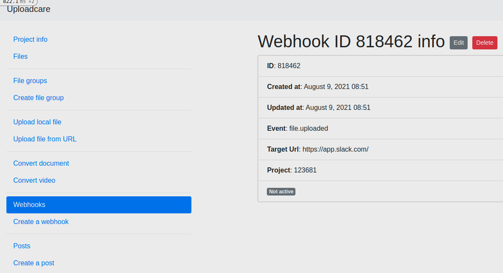

To create a new webhook, click the `Create a webhook` button in the menu. On the form, you should specify an URL for your webhook and check if it should be enabled immediately.

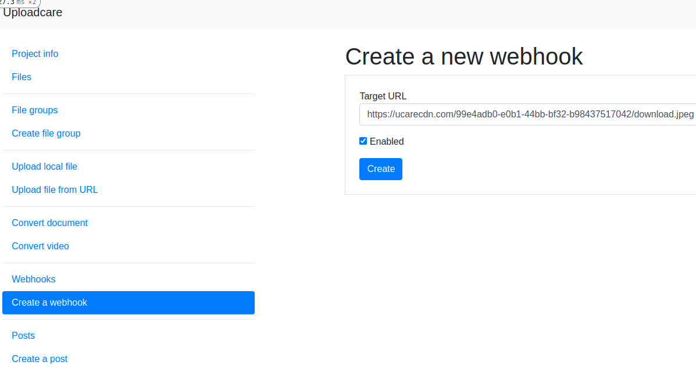

### Metadata section

File metadata is additional, arbitrary data, associated with uploaded file.

Show file metadata:
1. select file and run showing metadata
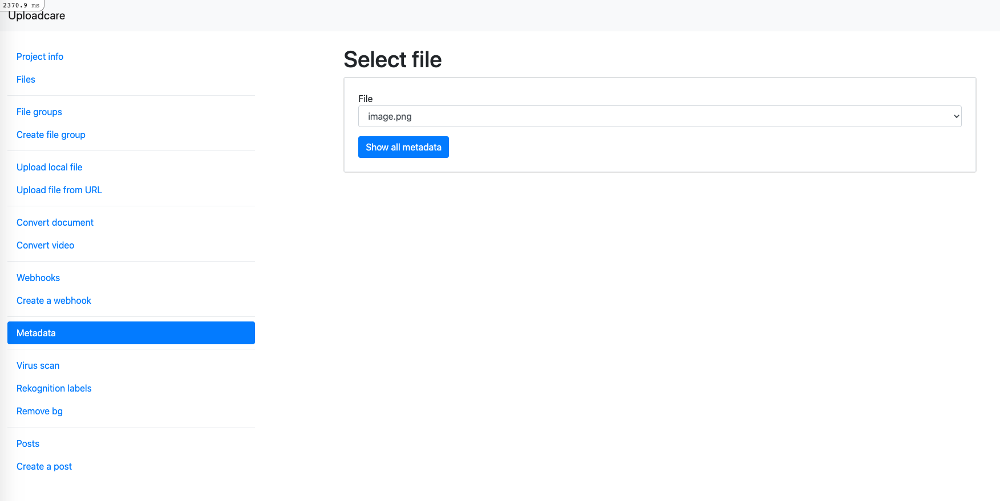
2. show/create/update/delete metadata by key
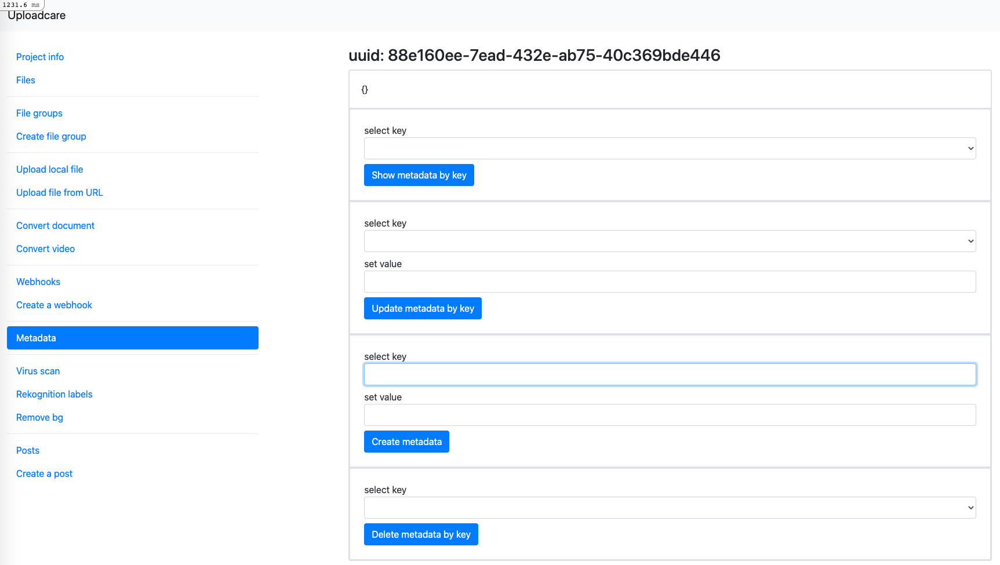

### Add-Ons section

An Add-On is an application implemented by Uploadcare that accepts uploaded files as an input and can produce other files and/or appdata as an output.

#### Virus scan

Execute file virus checking:
1. select file and run checking
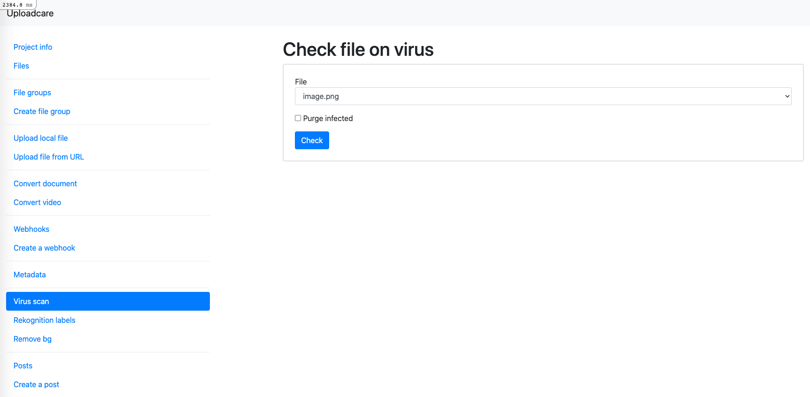
2. check operation status
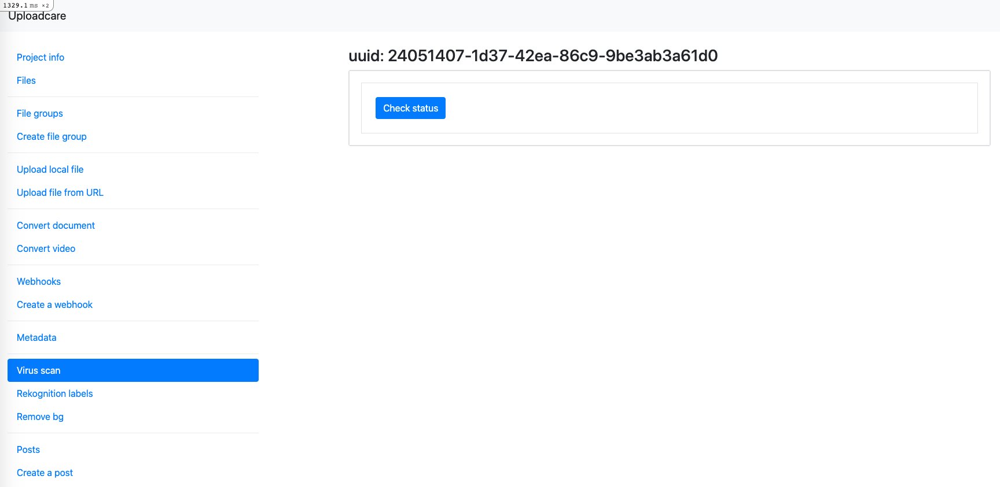

#### Rekognition Labels

Execute file rekognition labels:
1. select file and run checking
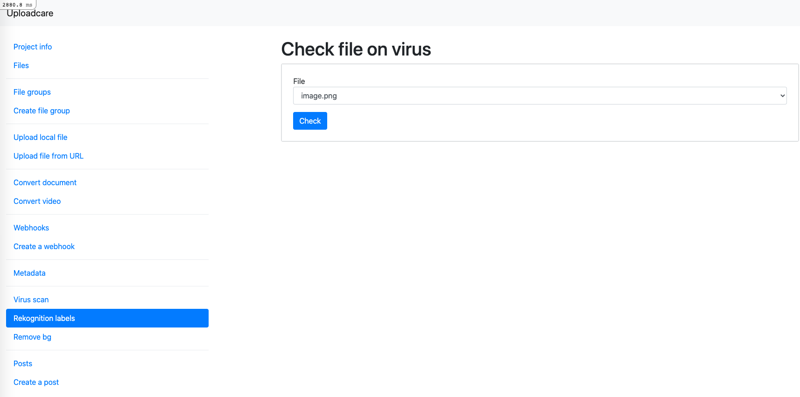
2. check operation status
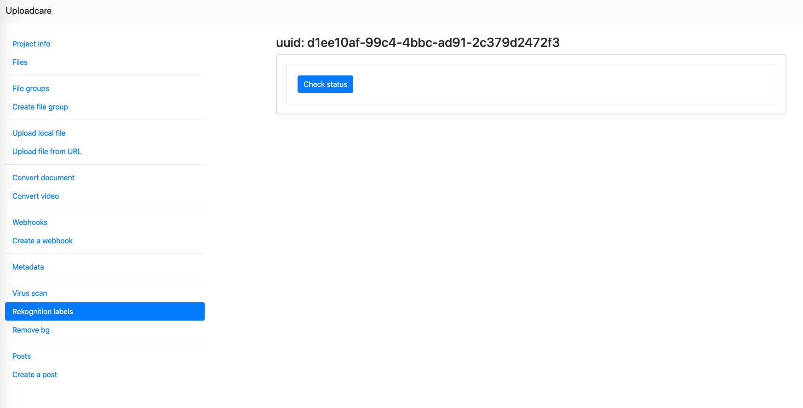

#### Rekognition Moderation Labels

Execute file rekognition moderation labels:
1. select file and run checking
2. check operation status

#### Remove BG

Execute file removing background:
1. select file and run checking
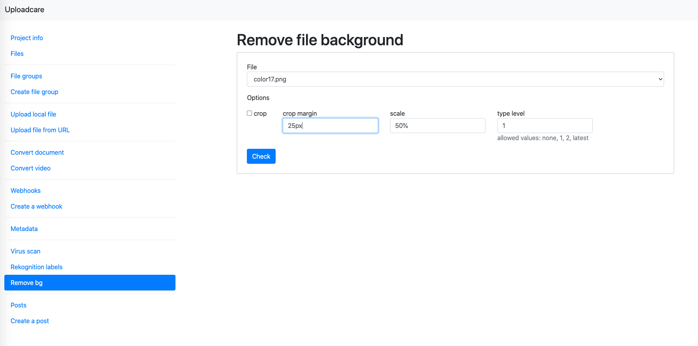
2. check operation status
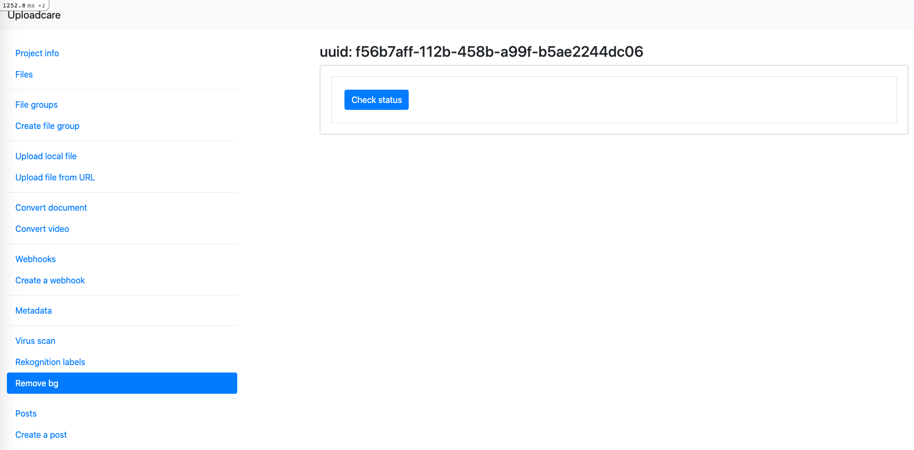

### Posts section

This section demonstrates the rewrite-era model API together with direct Uploadcare File Uploader Web Components in the view layer.
The app has a model called `Post` with fields `title:String`, `logo:String`, and `attachments:String`.
The model uses `has_uploadcare_file :logo` and `has_uploadcare_files :attachments`, so the stored values are Uploadcare CDN URLs wrapped by `Uploadcare::Rails::AttachedFile` and `Uploadcare::Rails::AttachedFiles`.

Index page for posts shows a list of posts. Each list item has `edit/delete` actions.

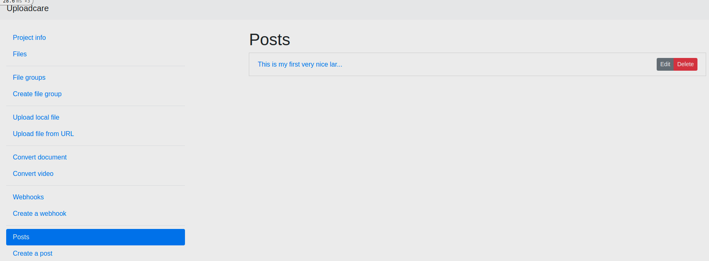

Clicking on a title opens the `show` page for a post.

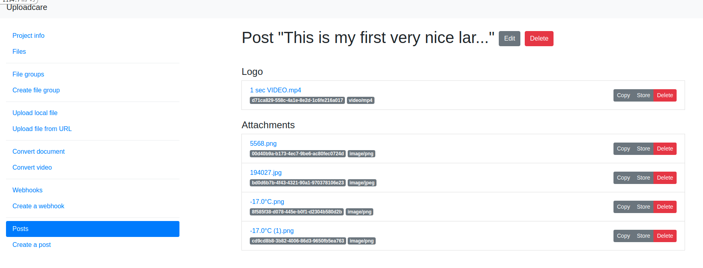

To create a new post, click on the `Create a post` button. The form contains a text field for the title plus two direct Uploadcare component sets: one for the single logo and one for grouped attachments. The attachments uploader uses `multiple="true"` and `group-output="true"` so it submits a single Uploadcare group URL. The edit form preloads both existing Uploadcare values back into the components.

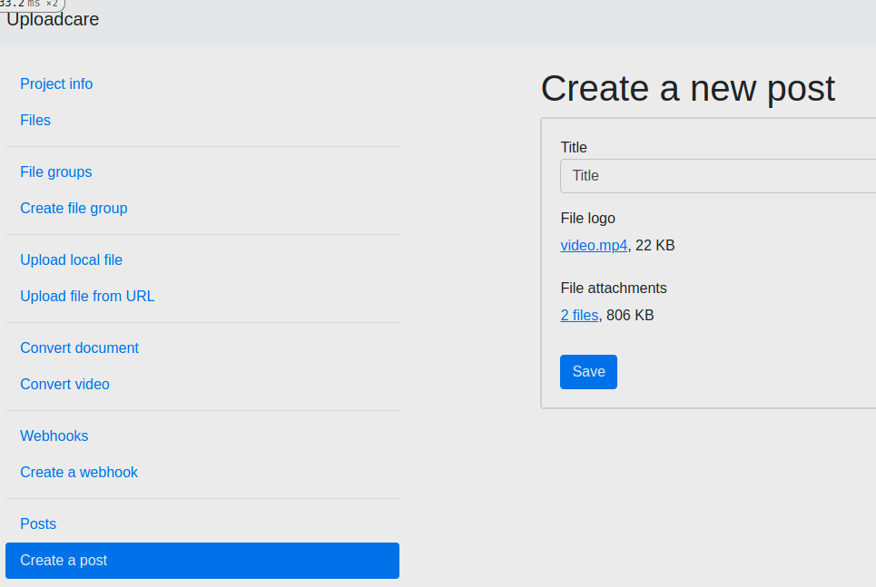

### Active Storage section

This section demonstrates the standard Rails attachment APIs with a dedicated `ActiveStoragePost` model. It uses `has_one_attached :cover_image` and `has_many_attached :attachments`, so the controller and views look like normal Rails code while remaining compatible with Uploadcare's Active Storage service.

The app ships with an `uploadcare` entry in `config/storage.yml`:

```yml
uploadcare:
  service: Uploadcare
  public_key: <%= ENV.fetch("UPLOADCARE_PUBLIC_KEY", "demopublickey") %>
  secret_key: <%= ENV.fetch("UPLOADCARE_SECRET_KEY", "demoprivatekey") %>
  public: true
```

To run the Active Storage example through Uploadcare, set `config.active_storage.service = :uploadcare` in the environment you want to exercise. The request and system specs keep using the Rails `test` service so they stay deterministic and do not require network calls.

The `Active Storage posts` pages show:

- one attached cover image via `has_one_attached`
- many attached files via `has_many_attached`
- standard blob metadata such as filename, content type, byte size, and service name

### Comments section (Mongoid ORM)

This section demonstrates the same rewrite model API with Mongoid. The app has a `Comment` model with fields `content:String`, `image:String`, and `attachments:String`. The model uses `has_uploadcare_file :image` and `has_uploadcare_files :attachments`, while the form renders direct Uploadcare web components and preloads stored values on edit.

Index page for comments shows a list of comments. Each list item has `edit/delete` actions.
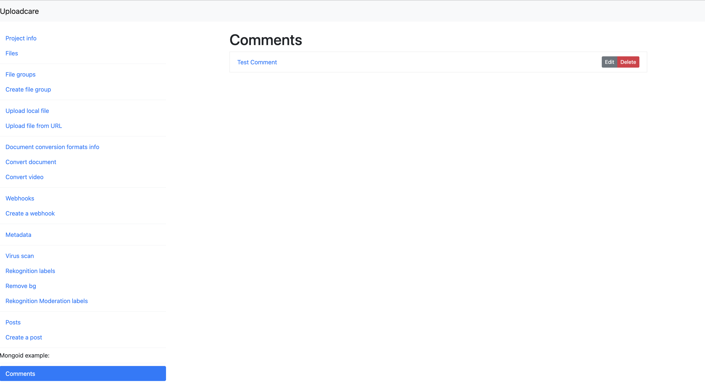

Clicking on content opens the `show` page for a comment.
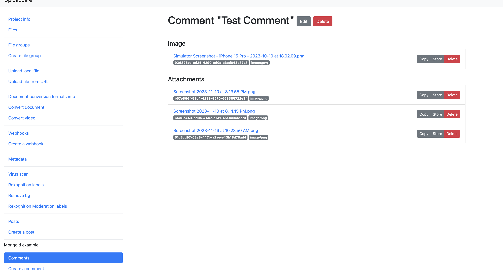

To create a new comment, click on the `Create a comment` button. The form contains a text field for the content plus Uploadcare fields for the single image and grouped attachments.
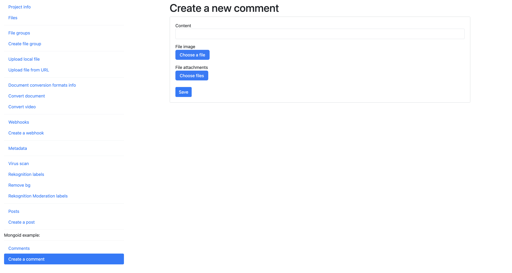

Edit a comment by clicking the `Edit` button on the `show` page. You can change the content, image, and attachments.
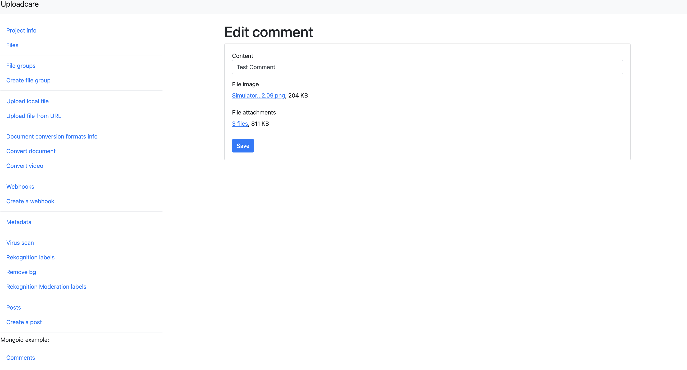

## Verification

The current app state was verified with:

```console
$ mise exec -- bundle install
$ mise exec -- pnpm install
$ mise exec -- pnpm build
$ mise exec -- ruby -e 'require "./config/environment"; puts Rails.version'
$ mise exec -- bundle exec rspec
$ mise exec -- bundle exec rspec spec/system
$ mise exec -- bundle exec rubocop
```

## Useful links
* [Uploadcare documentation](https://uploadcare.com/docs/?utm_source=github&utm_medium=referral&utm_campaign=uploadcare-rails)
* [Upload API reference](https://uploadcare.com/api-refs/upload-api/?utm_source=github&utm_medium=referral&utm_campaign=uploadcare-rails)
* [REST API reference](https://uploadcare.com/api-refs/rest-api/?utm_source=github&utm_medium=referral&utm_campaign=uploadcare-rails)
* [Contributing guide](https://github.com/uploadcare/.github/blob/master/CONTRIBUTING.md)
* [Security policy](https://github.com/uploadcare/uploadcare-rails/security/policy)
* [Support](https://github.com/uploadcare/.github/blob/master/SUPPORT.md)
* [A Ruby plugin for Uploadcare service](https://github.com/uploadcare/uploadcare-ruby)
* [A Ruby on Rails plugin for Uploadcare service](https://github.com/uploadcare/uploadcare-rails)
