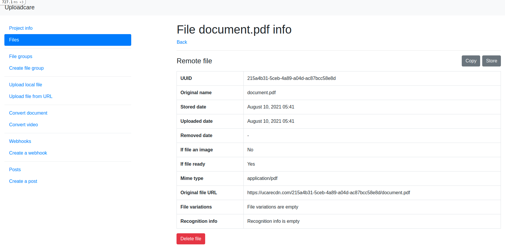
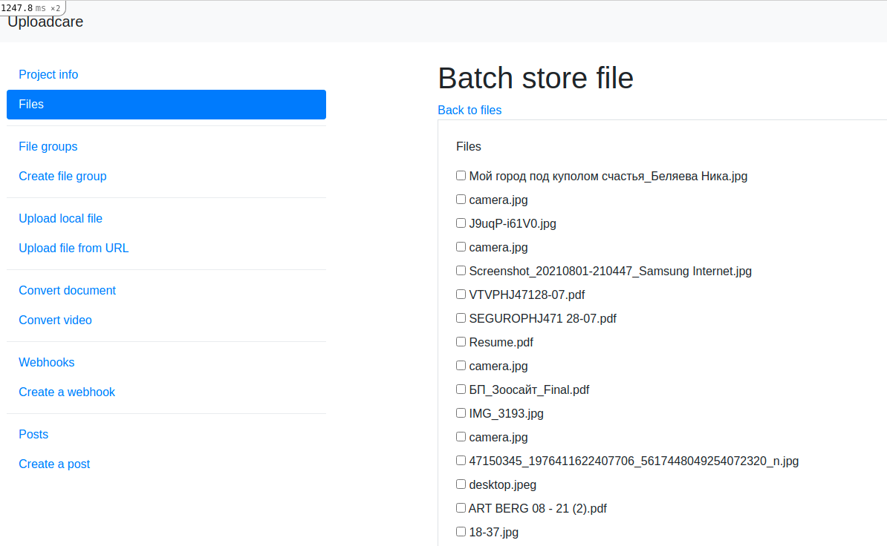
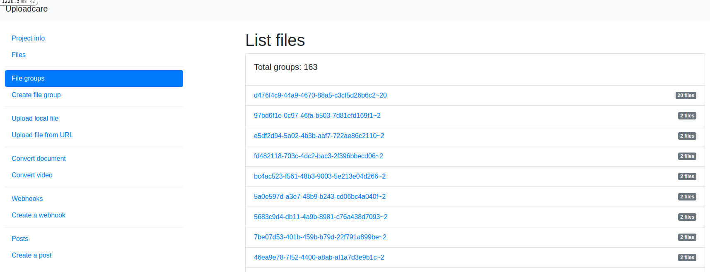
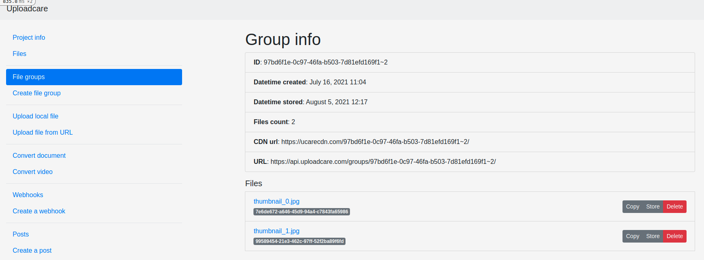
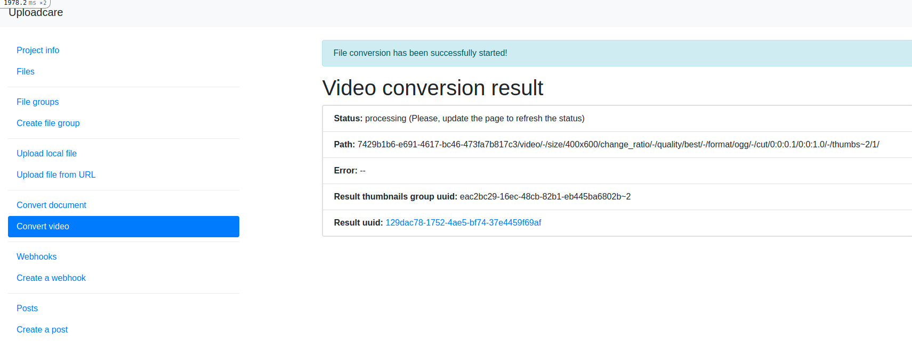
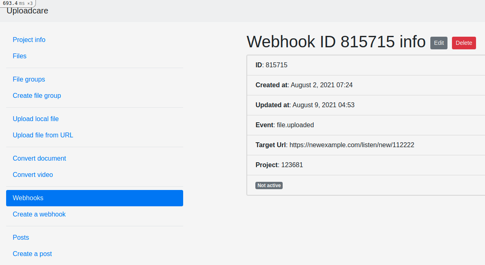
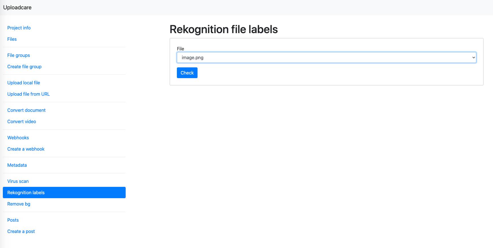
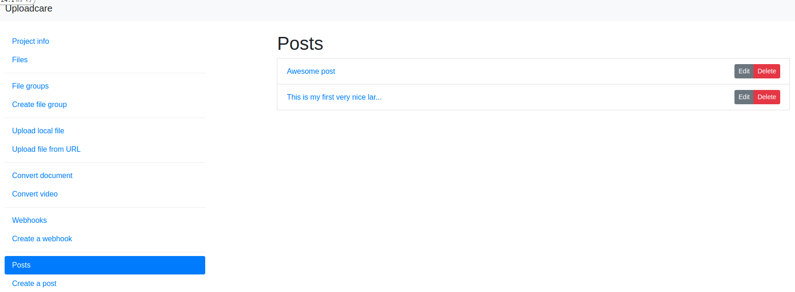
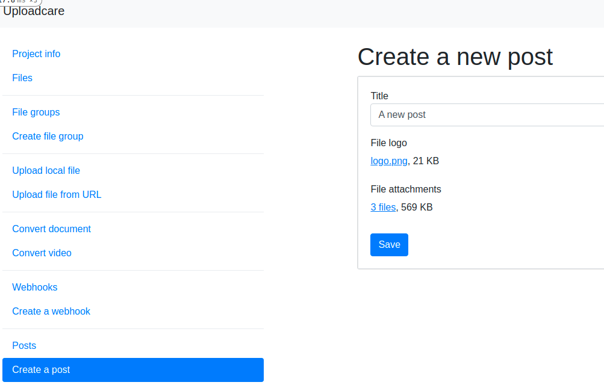

# Uploadcare Rails Example app

This example project demonstrates the uploadcare-rails capabilities.
The project is based on Ruby 3.3.0, Rails 7.1 and PostgreSQL.

* [Installation](#installation)
  * [Using docker](#using-docker)
  * [Without docker](#without-docker)
* [Usage](#usage)
  * [Configuration](#configuration)
  * [Project section](#project-section)
  * [Files section](#files-section)
  * [File Groups section](#file-groups-section)
  * [Files uploading](#files-uploading)
    * [Upload a local file](#upload-a-local-file)
    * [Upload a file from URL](#upload-a-file-from-url)
  * [Conversion](#conversion)
    * [Documents conversion](#documents-conversion)
    * [Video conversion](#video-conversion)
  * [Webhooks](#webhooks)
  * [Metadata section](#metadata-section)
  * [Add-Ons section](#add-ons-section)
    * [Virus scan](#virus-scan)
    * [Rekognition Labels](#rekognition-labels)
    * [Remove BG](#remove-bg)
  * [Posts section](#posts-section)
* [Useful links](#useful-links)

## Installation

### Using Docker

First, clone the repository:
```console
$ git clone git@github.com:uploadcare/uploadcare-rails-example.git
```

Then generate a `GITHUB_TOKEN` [here](https://github.com/settings/tokens)
with a selected checkbox `write:packages`.

After that, create the `docker-compose.yml` file, and copy the content from the `docker-compose.yml.sample` file there.
Then replace `YOUR_GITHUB_TOKEN` with generated `GITHUB_TOKEN` in the `docker-compose.yml` file.

To install the example application you need to [install Docker Compose package](https://docs.docker.com/compose/install/).
When Docker Compose is installed, build a Docker image by using the `build` command:

```console
$ docker-compose build
```

This command will build an image for the application.

When the image is ready — up the containers with the following command.

```console
$ docker-compose up
```

Then, create a new database with command:

```console
$ docker-compose exec web rails db:create db:migrate
```

Now, the application must be available in your web-browser, on `http://localhost:3000`


### Without docker

First of all, clone this repository:

```console
$ git clone git@github.com:uploadcare/uploadcare-rails-example.git
```

Make sure Ruby and Rails are installed on your system. Fire command prompt and run command:

```console
$ ruby -v
# => ruby 3.3.0 (2023-12-25 revision 5124f9ac75) [arm64-darwin23]
$ rails -v
# => Rails 7.1.3.2
```

If Ruby or(and) Rails are not installed, check out following links with instructions, how to install those:
* [Install ruby](https://www.ruby-lang.org/en/documentation/installation/)
* [Getting started with Rails](https://guides.rubyonrails.org/v7.1/getting_started.html)

Then install gems:

```console
$ bundle install
```

After gems are installed, set your PostgreSQL credentials(env vars POSTGRES_USERNAME, POSTGRES_PASSWORD) and create a new local database:

```console
$ rake db:create
$ rake db:migrate
```

Now, you can run the rails server:

```console
$ rails s
```

and see the application available in your web-browser, on `http://localhost:3000`

## Usage

### Configuration

To start using tha application you need to set your API keys (public key and secret key).
These keys can be set as ENV variables using the `export` directive:

```console
$ export UPLOADCARE_PUBLIC_KEY=demopublickey
$ export UPLOADCARE_SECRET_KEY=demoprivatekey
```
Or you can use popular gems like `dotenv-rails` for setting ENV variables.

Run the config generator command to generate a configuration file:

```console
$ rails g uploadcare_config
```

The generator will create a new file in `config/initializers/uploadcare.rb`.

The public key must be specified in `config/initializers/uploadcare.rb` to use Uploadcare file upload.
This step is done automatically in the initializer if you set the ENV variable `UPLOADCARE_PUBLIC_KEY` earlier.

```ruby
...
Uploadcare::Rails.configure do |config|
  # Sets your Uploadcare public key.
  config.public_key = ENV.fetch('UPLOADCARE_PUBLIC_KEY', 'demopublickey')
  ...
end
```

There are also some options set by default:

```ruby
...
# Deletes files from Uploadcare servers after object destroy.
config.delete_files_after_destroy = true

# Sets caching for Uploadcare files
config.cache_files = true

# Available locales currently are:
# ar az ca cs da de el en es et fr he it ja ko lv nb nl pl pt ro ru sk sr sv tr uk vi zhTW zh
config.locale = 'en'

# If true, inputs on your page are initialized automatically, see the article for details -
# https://uploadcare.com/docs/file-uploader-api/widget-initialization/
config.live = true

# If true, input initialization is invoked manually.
# See https://uploadcare.com/docs/file-uploader-api/widget-initialization/).
config.manual_start = false
```

Then you can configure all global variables such as files storing/caching, deleting files, etc.
Full list of available options is listed in the file itself. Just uncomment an option and set the value.


### Project section

You can get the project information by your public key.


### Files section

This section contains operations with files. Such as uploading, copying, storing, deleting.
The page shows all the files you have on Uploadcare servers. Each file has actions, so it is possible to manage files on this page as well as on the `show` page.


To go to the `show` page, simply click on a filename:



The `index` page also has links to files batch operations pages — batch store and batch delete.
Pages for batch operations look similar and allow to select several files to store them or delete at once.



### File Groups section

File Groups section provides user interface to manage file groups on Uploadcare.

The `index` page shows a minimal info about each group including ID and files count.



Click on a group ID, you go to the `show` group page:



This page also provides actions to manage group files and a group itself (`store` operation only unless a group is already stored).

To create a new group, click on the `Create file group` button in the menu. The form will be opened:


### Files uploading

Example up can upload files in three ways: it uploads local files via API interface (along with a view form), local files via Widget (see [Posts section](#posts-section)) and uploading remote files from URL.

---
**NOTE**

The locales from the widget can be customized by the `config.locale_translations` option in the [initializer](./config/initializers/uploadcare.rb). The widget localizations can be found [here](https://github.com/uploadcare/uploadcare-widget/tree/master/src/locales). The default locale is `en`.
Here's an example of how to override some translations: [config/initializers/uploadcare.rb](./config/initializers/uploadcare.rb#L82).
Don't forget to specify the path to translation files in the initializer here: [config/initializers/uploadcare.rb](./config/initializers/uploadcare.rb#L4).

---

#### Upload a local file

To upload local file from your machine, click on `Upload local file` button in the menu. Then click `Browse` on the form and check a file to upload.
All the fields in the form will be filled automatically depending on file's mime-type and filename. You can input your custom mime-type and filename, though.
There is also `Store` option indicating if Uploadcare will store your file permanently (if enabled) or remove it after 24 hours.


#### Upload a file from URL

To upload a file from URL, click on the appropriate button in the menu. This form has one text input for an URL and one for a filename. `Store` option is present as well.
All you need is input file's URL and filename, check (or not) the `Store` check-box and a file will be uploaded.


### Conversion

The application can manage documents and video conversions sending request to [Uploadcare REST API Conversion endpoints](https://uploadcare.com/api-refs/rest-api/v0.5.0/#tag/Conversion).

---
**NOTE**

Remember, to convert files, your account must have this feature enabled. It means that your UPLOADCARE_PUBLIC_KEY and UPLOADCARE_SECRET_KEY (not demo keys) must be specified in `config/initializers/uploadcare.rb`. This feature is only available for paid plans.

---

#### Documents conversion

To convert a document, go to the `Convert document` section, choose a file to convert, target format and page (if the chosen target format is `jpg` or `png` and you want to convert a single page of a multi-paged document). There are two check-boxes. `Store` is responsible for storing files as mentioned above. And the `Throw error` option detects if the app should raise an error instead of rescuing this within a simple flash message.


After the form is submitted, you'll see a `Conversion result page`, which shows some info about conversion: `Status`, `Error` and output file's UUID.
Updating the page will refresh the status as said on the page.


#### Video conversion

Video conversion works the same way but the form has some additional parameters to set. As the document form it has `File`, `Target format` and check-boxes — `Throw error` and `Store`. But you can also specify `quality`, `resize`, `cut` and `thumbs` options.


Conversion result page also includes information about how conversion is going.




### Webhooks

The `webhooks` section represents CRUD(create, read, update, delete) operations for Uploadcare webhooks.

---
**NOTE**

Remember, to manage webhooks, your account must have this feature enabled. It means that your UPLOADCARE_PUBLIC_KEY and UPLOADCARE_SECRET_KEY (not demo keys) must be specified in `config/initializers/uploadcare.rb`. This feature is only available for paid plans.

---

The menu button `Webhooks` points to the webhooks list page. Each list item has `edit/delete` actions and minimal info about a webhook.


Clicking on an ID of a list item redirects you to the `show` page of a webhook. Here you can find additional info and actions.



To create a new webhook, click the `Create a webhook` button in the menu. On the form, you should specify an URL for your webhook and check if it should be enabled immediately.


### Metadata section

File metadata is additional, arbitrary data, associated with uploaded file.

Show file metadata:
1. select file and run showing metadata

2. show/create/update/delete metadata by key


### Add-Ons section

An Add-On is an application implemented by Uploadcare that accepts uploaded files as an input and can produce other files and/or appdata as an output.

#### Virus scan

Execute file virus checking:
1. select file and run checking

2. check operation status


#### Rekognition Labels

Execute file rekognition labels:
1. select file and run checking

2. check operation status


#### Remove BG

Execute file removing background:
1. select file and run checking

2. check operation status


### Posts section

This section of the application made to demonstrate view helpers that allow to place Uploadcare File Uploader widget to a Rails view.
The app has a model called Post and having fields `title:String`, `logo:String` and `attachments:String`. Logo and attachments represent `Uploadcare::File` and `Uploadcare::Group` respectively.

Index page for posts shows a list of posts. Each list item has `edit/delete` actions.



Clicking on title will direct you to the `show` page of a post.


To create a new post, click on the `Create a post` button. The post form will be opened. The form contains a text field for post title, one File Uploaders — for post's logo and one — for post's attachments. These File Uploaders differ from each other by the `multiple` option. For logo it is `false`, and for attachments — `true`.



## Useful links
* [Uploadcare documentation](https://uploadcare.com/docs/?utm_source=github&utm_medium=referral&utm_campaign=uploadcare-rails)
* [Upload API reference](https://uploadcare.com/api-refs/upload-api/?utm_source=github&utm_medium=referral&utm_campaign=uploadcare-rails)
* [REST API reference](https://uploadcare.com/api-refs/rest-api/?utm_source=github&utm_medium=referral&utm_campaign=uploadcare-rails)
* [Contributing guide](https://github.com/uploadcare/.github/blob/master/CONTRIBUTING.md)
* [Security policy](https://github.com/uploadcare/uploadcare-rails/security/policy)
* [Support](https://github.com/uploadcare/.github/blob/master/SUPPORT.md)
* [A Ruby plugin for Uploadcare service](https://github.com/uploadcare/uploadcare-ruby)
* [A Ruby on Rails plugin for Uploadcare service](https://github.com/uploadcare/uploadcare-rails)
